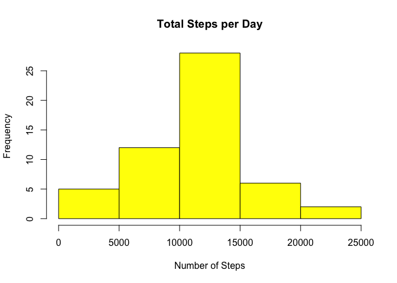
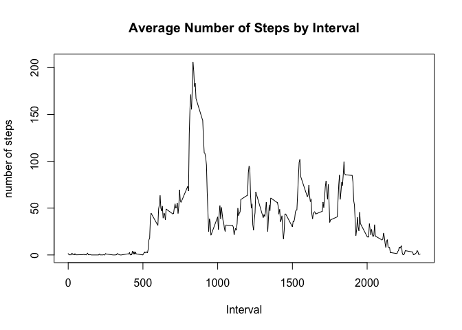
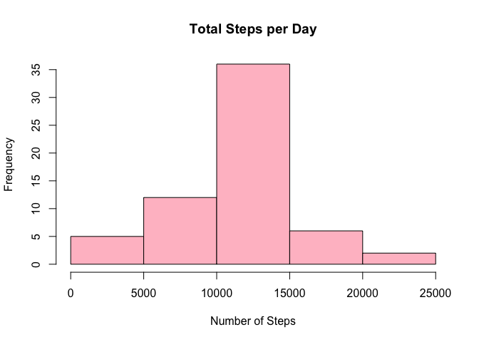
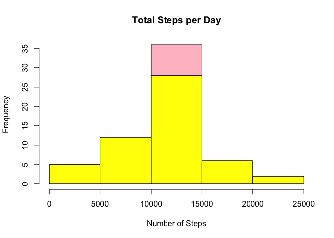
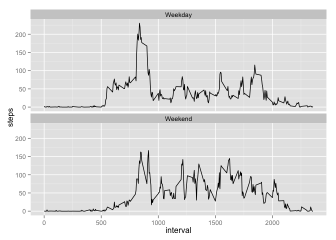

# Reproducible Research: Peer Assessment 1
Sachi Norman  
Sunday, November 14, 2015  
## Introduction

It is now possible to collect a large amount of data about personal movement using activity monitoring devices such as a Fitbit, Nike Fuelband, or Jawbone Up. These type of devices are part of the "quantified self" movement - a group of enthusiasts who take measurements about themselves regularly to improve their health, to find patterns in their behavior, or because they are tech geeks. But these data remain under-utilized both because the raw data are hard to obtain and there is a lack of statistical methods and software for processing and interpreting the data.

This assignment makes use of data from a personal activity monitoring device. This device collects data at 5 minute intervals through out the day. The data consists of two months of data from an anonymous individual collected during the months of October and November, 2012 and include the number of steps taken in 5 minute intervals each day.

## Loading and preprocessing the data

The data for this assignment can be downloaded from the course web site:
Dataset: Activity monitoring data [52K]

The variables included in this dataset are:

1. steps: Number of steps taking in a 5-minute interval (missing values are coded as NA)

2. date: The date on which the measurement was taken in YYYY-MM-DD format

3. interval: Identifier for the 5-minute interval in which measurement was taken

The dataset is stored in a comma-separated-value (CSV) file and there are a total of 17,568 observations in this dataset.


```r
activity <- read.csv("activity.csv")
```

## What is mean total number of steps taken per day?

1. Make a histogram of the total number of steps taken each day


```r
totaltbl <- aggregate(steps~date,FUN=sum,data=activity)
hist(totaltbl$steps, main="Total Steps per Day",xlab="Number of Steps",col="yellow")
```

 

2. The mean total number of steps taken per day is **** and the 
median is ****

## What is the average daily activity pattern?

1. Make a time series plot (i.e. type = "l") of the 5-minute interval (x-axis) and the average number of steps taken, averaged across all days (y-axis)


```r
meantbl <- aggregate(steps~interval,FUN=mean,data=activity)
plot(x=meantbl$interval,y=meantbl$steps,type="l", main="Average Number of Steps by Interval",xlab="Interval",ylab="number of steps")
```

 

2. Which 5-minute interval, on average across all the days in the dataset, contains the maximum number of steps?


```r
meantbl[meantbl$steps==max(meantbl$steps),]$interval
```

The interval **835** has the maximum number 
of steps on average.


## Imputing missing values

Note that there are a number of days/intervals where there are missing values (coded as NA). The presence of missing days may introduce bias into some calculations or summaries of the data.

1. Calculate and report the total number of missing values in the dataset (i.e. the total number of rows with NAs)


```r
totalna <- length(which(is.na(activity$steps)))
```

The total number of rows with missing values is **2304**.

2. Devise a strategy for filling in all of the missing values in the dataset. Create a new dataset that is equal to the original dataset but with the missing data filled in.
Missing data was imputed by inserting the average number of steps for the same interval over all days.


```r
imputed_data <- transform(activity, steps = ifelse(is.na(activity$steps), meantbl$steps[match(activity$interval, meantbl$interval)], activity$steps))
```

3. Make a histogram of the total number of steps taken each day


```r
totaltblimp <- aggregate(steps~date,FUN=sum,data=imputed_data)
hist(totaltblimp$steps, main="Total Steps per Day",xlab="Number of Steps",col="pink")
```

 


4. Calculate and report the mean and median total number of steps taken per day.

```r
meanimp <- mean(totaltblimp$steps)
medianimp <- median(totaltblimp$steps)
```

The mean number of steps per day after imputation is **1.0766189\times 10^{4}** and the median
is **1.0766189\times 10^{4}**.

5. Do these values differ from the estimates from the first part of the assignment?

The difference for the mean is **0** and the difference for the 
median is **-1.1886792**

6. What is the impact of imputing missing data on the estimates of the total daily number of steps?

```r
hist(totaltblimp$steps, main="Total Steps per Day",xlab="Number of Steps",col="pink")

hist(totaltbl$steps, main="Total Steps per Day",xlab="Number of Steps",col="yellow",add=T)
```

 


## Are there differences in activity patterns between weekdays and weekends?

Create a new factor variable in the dataset with two levels - "weekday" and "weekend" indicating whether a given date is a weekday or weekend day.


```r
weekdays <- c("Monday", "Tuesday", "Wednesday", "Thursday", 
              "Friday")
imputed_data$weekpart = as.factor(ifelse(is.element(weekdays(as.Date(imputed_data$date)),weekdays), "Weekday", "Weekend"))

stepsintimp <- aggregate(steps ~ interval + weekpart, imputed_data, mean)
```

Make a panel plot containing a time series plot (i.e. type = "l") of the 5-minute interval (x-axis) and the average number of steps taken, averaged across all weekday days or weekend days (y-axis). 


```r
library(ggplot2)
ggplot(stepsintimp, aes(x = interval, y = steps, group = weekpart)) + geom_line() + facet_wrap(~ weekpart,ncol=1,nrow=2)
```

 


